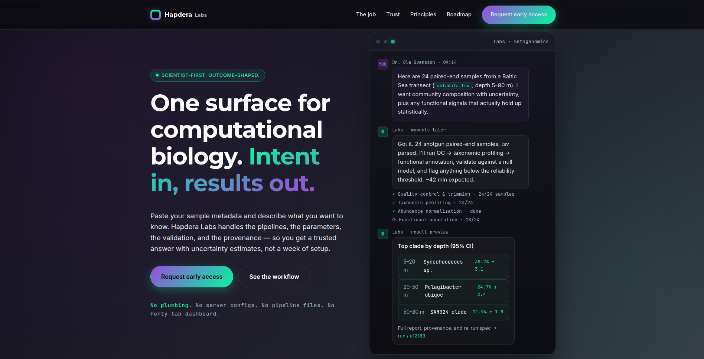

  

<h1 align="center">Hapdera</h1>

  <strong>AI-native computational biology, from question to result.</strong> 
  The rigor of a research lab, with the engineering to take the results into production.

  <a href="https://hapdera.com">🌐 hapdera.com</a> ·
  <a href="mailto:info@hapdera.com">✉️ info@hapdera.com</a>

## Who we are

Hapdera is an independent **computational-biology and bioinformatics practice**. For the
past several years we've worked directly with teams across the life sciences: protein
modeling and optimization, metabolic modeling and omics integration, and the analysis of
metagenomic and metabarcoding datasets, taking research questions through to reproducible
software they can build on.

Clients work directly with a senior scientist: no hand-offs, no account-management layer
between you and the analysis. Rigorous science and production engineering, with no
translation loss between them.

## What we do

| Area | |
|---|---|
| 🧬 **Protein Characterization & Engineering** | Predicting structure, function, and biophysical properties, and guiding the design of improved variants. |
| ⚗️ **Metabolic Modeling & Omics Integration** | Genome-scale reconstruction, flux balance analysis, and constraint-based methods, from single strains to microbial communities. |
| 🦠 **Metagenomics & Metabarcoding** | Taxonomic composition, diversity, and functional potential from amplicon and shotgun sequencing, as reproducible, provenance-tracked pipelines. |
| 🕸️ **Knowledge Graphs & LLM Systems** | Reasoning over biological knowledge graphs (GraphRAG) built from public databases, with agent-ready tooling for AI systems. |
| 📊 **Scientific AI Evaluation** | Expert-level problems and grading rubrics as rigorous test data for frontier AI: real tasks with defensible ground truth. |

## How we work

A small, deliberate engagement model, from the first scoping call to the final
reproducible deliverable.

1. **Scope the question.** We define the result you actually need and the standard it has to meet, before any compute runs.
2. **Run it rigorously.** Validated, reproducible methods with provenance tracked end to end, and modern AI applied where it earns its place.
3. **Ship a result you can build on.** Reproducible software and report-ready outputs, with direct access to the scientist who produced them.

## 🚀 Hapdera Labs *(early access)*

  

A single conversational surface for computational biology. Describe what you want to know
in plain language, and Labs returns a trusted, validated result, with honest uncertainty,
full provenance, and a one-click re-run. The first workflow is **metagenomics community
analysis**, productizing work we've run for clients for years, so it ships proven, not
speculative.

- Describe the analysis in plain language, no pipeline files, no dashboards
- Statistically validated, with honest uncertainty on every result
- Full provenance and a one-click re-run, reproducible by construction

➡️ **[Request early access](https://hapdera.com/#labs)**

## Get in touch

A few lines about the problem is enough to start.

- 🌐 Website: [hapdera.com](https://hapdera.com)
- ✉️ Email: [info@hapdera.com](mailto:info@hapdera.com)

  Led by <strong>Semidán Robaina, PhD</strong> · Founder &amp; Lead Scientist 
  <a href="https://scholar.google.com/citations?user=128jZTEAAAAJ&hl=en">Google Scholar</a> ·
  <a href="https://orcid.org/0000-0003-0781-1677">ORCID</a> ·
  <a href="https://github.com/Robaina">GitHub</a> ·
  <a href="https://www.linkedin.com/in/semidan-robaina/">LinkedIn</a>

